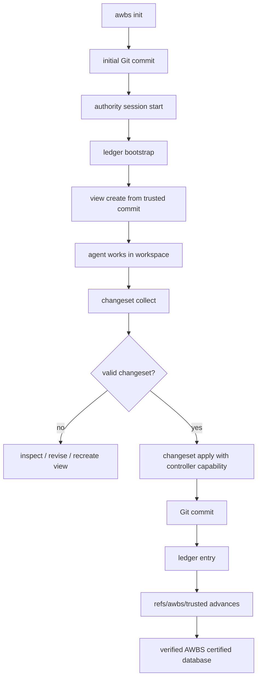

# AWBS 标准手册

基于 003 可信数据链的使用与接入手册。

本文档是 AWBS 的标准入口文档。`TASK_*.md` 是开发与设计记录，适合学习演进过程；本文档面向想理解、接入、试用或维护 AWBS 的用户。

## 1. AWBS 是什么

AWBS 是 **Agent Work Base Space** 的缩写。

一句话定位：

```text
AWBS 是面向 agent 工作流的文件系统数据库底座。
```

它把普通文件系统作为数据库主体，把 Git 作为版本管理器，把某一步工作需要的文件复制成独立工作空间视图，再用 changeset 和可信数据链决定哪些变更能进入 AWBS 认证数据库。

003 以后，AWBS 的核心定义是：

```text
AWBS 认证数据库
  = refs/awbs/trusted 指向的 Git tree
  + sealed authority ledger 可验证的 head entry
```

普通 Git `HEAD`、当前工作区文件、外部手写 commit，都不会自动成为 AWBS 认证数据库事实。

## 2. AWBS 不是什么

AWBS 不是：

- 操作系统权限系统。
- 传统 SQL 事务数据库。
- AI 摘要生成服务。
- workflow 编排器。
- 模型调度框架。
- 对抗 admin/root 的强安全系统。

AWBS 不阻止人或程序直接修改磁盘文件。它的职责是：只承认自己可信链路上的状态推进，把未认证写入暴露为可审计、可重建、可排除的偏离。

AWBS 永远不内置 AI 摘要。摘要由上层业务或外部工具写入，AWBS 只提供摘要读写和索引使用能力。

## 3. 核心模型

AWBS 由六个核心概念组成。

### 3.1 文件系统数据库

业务数据就是普通目录和普通文件。

```text
project/
  A/
  B/
  assets/
  reports/
```

AWBS 不规定业务目录如何组织。小说、仿真、文档、代码、素材、报告都可以按上层业务自己的结构保存。

### 3.2 Git 版本管理

Git 保存文件历史、diff、commit 和 tree。

AWBS 不重新发明文件版本系统，而是借用 Git 的成熟能力管理普通文件。

### 3.3 工作空间视图

某一步工作不一定需要整个数据库。

AWBS 从可信提交中选择路径，复制出一个独立 workspace：

```text
trustedCommit(Tn)
  -> selected paths
  -> workspace view
```

workspace 保持原路径结构，不做重命名。

### 3.4 View Contract

每个 view 有一个唯一 `viewId`，并在 `.awbs/authority` 下保存密封 view contract。

contract 记录：

- `viewId`
- `baseCommit`
- `readPaths`
- `writePaths`
- `createdAt`
- `sources`

workspace 里的 `.awbs-view.json` 只用于展示和索引，不是权限事实源。collect/apply 时，AWBS 必须回查密封 contract。

### 3.5 Changeset

changeset 是 AWBS 的最小可信变更单元。

一次新增、修改、删除都会被表达成 changeset：

```text
workspace changes
  -> manifest.json
  -> diff.patch
  -> files/
  -> payloadHash
  -> operationHash
  -> sealed receipt
```

只读路径发生变化时，changeset 可以被 collect 出来，但状态是 invalid，apply 永远拒绝。

### 3.6 Trusted Chain

003 的核心规则：

```text
trustedCommit(Tn)
  -> view projection 基于 Tn
  -> changeset 声明基于 Tn
  -> apply 只把 changeset 写入 Tn
  -> 生成 trustedCommit(Tn+1)
```

每次可信写入都会生成 ledger entry。AWBS 会验证：

- trusted commit 的父提交必须等于 ledger entry 的 `parentTrustedCommit`。
- trusted commit message 必须引用 ledger entry id、operation hash 和 parent trusted commit。
- trusted commit 相对 parent 的数据路径变更必须落在 ledger 声明的 `appliedPaths` 内。
- ledger 记录的 `appliedPathStates` 必须和 trusted commit 中最终文件内容 hash 一致。

`refs/awbs/trusted` 不是单独事实源。它指向的 commit 必须能被 sealed ledger head entry 证明。

## 4. 安装

环境要求：

- Node.js `>=24.0.0`
- Git

从 npm 安装：

```powershell
npm install -g @c956180462/awbs
awbs --help
```

从源码目录全局安装：

```powershell
npm install -g .
awbs --help
```

开发时直接运行：

```powershell
node bin\awbs.js --help
npm run awbs -- --help
```

## 5. 标准最小流程

这一节给出 AWBS 的标准最小闭环。

### 5.1 初始化数据库

```powershell
mkdir my-awbs-db
cd my-awbs-db
awbs init
```

如果当前目录不是 Git repo，`awbs init` 会执行 `git init`，并创建 `.awbs/` 基础结构。

创建业务目录和初始数据：

```powershell
mkdir A
mkdir B
"read only context" | Set-Content A\context.md
"first draft" | Set-Content B\draft.md
```

创建初始 Git commit：

```powershell
git add .
git commit -m "initialize database"
```

如果 Git 没有用户信息，先配置：

```powershell
git config user.name "AWBS User"
git config user.email "awbs@example.test"
```

AWBS 不自动创建 initial commit。初始数据库内容应该由上层应用或用户明确决定。

### 5.2 启动 Authority Session

005 当前实现的是 A 模式：运行期本地钥匙托管。

开发试用时可以使用简单字符串。正式应用中，`recoverySecret` 和 `controllerToken` 应由上层应用的非 AI 控制层管理。

```powershell
'{"recoverySecret":"dev-recovery","controllerToken":"dev-controller"}' |
  awbs authority session start --control-stdin
```

检查状态：

```powershell
awbs authority session status
```

session start 成功后：

- AWBS 读取 `.awbs/private/local.json`。
- 写入 `.awbs/private/recovery.seal.json`。
- 删除磁盘上的 `.awbs/private/local.json`。
- 启动同用户后台 session daemon。
- key 只保留在 daemon 内存中。

### 5.3 启动 Trusted Chain

```powershell
'dev-controller' | awbs ledger bootstrap --control-token-stdin
```

检查 ledger：

```powershell
awbs ledger inspect
awbs ledger verify
```

bootstrap 后，AWBS 才有认证数据库头。

### 5.4 建立索引

```powershell
awbs index rebuild
awbs index query
awbs index query draft
```

索引默认写入：

```text
.awbs/index/files.sqlite
```

索引基于当前 verified trusted commit 重建，不以污染工作区作为事实源。

### 5.5 写入外部摘要

AWBS 不生成摘要。上层业务可以写入摘要：

```powershell
awbs summary set B/draft.md --text "A draft document owned by the business layer."
awbs summary get B/draft.md
awbs summary list
awbs index rebuild
awbs index query business
```

摘要文件：

```text
.awbs/summaries/files.jsonl
```

摘要不是 AWBS 内置 AI 结果，而是上层业务写给 AWBS 使用的上下文索引材料。

### 5.6 创建工作空间视图

```powershell
'dev-controller' |
  awbs view create --out ..\my-awbs-workspace --read A --write B --control-token-stdin
```

含义：

- `A` 被复制进 workspace，但只读。
- `B` 被复制进 workspace，可写。
- workspace 保持原目录结构。
- view 基于当前 verified trusted commit 投影，不读取污染工作区。

查看 view：

```powershell
awbs view inspect <viewId>
```

### 5.7 在 workspace 中工作

修改可写目录：

```powershell
"second draft" | Set-Content ..\my-awbs-workspace\B\draft.md
```

如果修改了只读目录，例如 `A/context.md`，collect 仍会生成 changeset，但 changeset 状态是 invalid。

### 5.8 收集 changeset

```powershell
awbs changeset collect --workspace ..\my-awbs-workspace
```

检查 changeset：

```powershell
awbs changeset inspect <changesetId>
awbs changeset inspect <changesetId> --json
```

changeset 会保存到：

```text
.awbs/changesets/<changesetId>/
  manifest.json
  diff.patch
  files/
  receipt.seal.json
```

### 5.9 应用 changeset

```powershell
'dev-controller' | awbs changeset apply <changesetId> --control-token-stdin
```

apply 前 AWBS 会检查：

- authority session 可用。
- controller capability 有效。
- changeset payload 未被篡改。
- view contract 未被篡改。
- view 未 revoked。
- changeset 基于当前 trusted commit。
- 当前 trusted commit 被 ledger 验证通过。
- 只读路径没有变化。

成功后：

- 可写路径变化写回数据库同名路径。
- Git 创建新 commit。
- ledger 追加 entry。
- `refs/awbs/trusted` 推进到新 commit。

### 5.10 审计数据库状态

```powershell
awbs db audit
awbs ledger verify
awbs authority verify
```

如果工作区或普通 Git HEAD 偏离 trusted chain，AWBS 会报告偏离。偏离不会自动成为认证数据库。

### 5.11 停止 Authority Session

```powershell
'dev-controller' | awbs authority session stop --control-token-stdin
```

正常 stop 后，daemon 会把内存中的 local material 写回 `.awbs/private/local.json`，并清理 session 状态。

如果 session 异常退出，使用恢复因子恢复：

```powershell
'dev-recovery' | awbs authority session recover --recovery-secret-stdin
```

## 6. 典型流程图



## 7. 数据结构速览

### 7.1 `.awbs/authority/repo.json`

公开仓库参数：

```json
{
  "schemaVersion": 1,
  "repoId": "uuid",
  "authoritySalt": "base64",
  "algorithm": "AWBS-AES-256-GCM-v1",
  "kdf": "scrypt-repo-local-runtime-v1",
  "trustMode": "ephemeral-local-key-v1"
}
```

### 7.2 View Contract

密封 contract 解密后的核心结构：

```json
{
  "schemaVersion": 1,
  "viewId": "uuid",
  "baseCommit": "git commit",
  "createdAt": "iso time",
  "readPaths": ["A"],
  "writePaths": ["B"],
  "sources": [],
  "ext": {}
}
```

### 7.3 Changeset Manifest

核心字段大体包括：

```json
{
  "schemaVersion": 1,
  "changesetId": "changeset_xxx",
  "viewId": "uuid",
  "baseCommit": "git commit",
  "status": "valid",
  "records": [],
  "violations": [],
  "payloadHash": "sha256:...",
  "operationHash": "sha256:..."
}
```

### 7.4 Ledger Entry

ledger entry 是可信链状态推进记录：

```json
{
  "schemaVersion": 1,
  "entryId": "uuid",
  "kind": "bootstrap | changeset",
  "previousEntryHash": "sha256:...",
  "parentTrustedCommit": "git commit",
  "baseCommit": "git commit",
  "changesetId": "changeset_xxx",
  "viewId": "uuid",
  "appliedPaths": [],
  "appliedPathStates": [],
  "changesetManifestHash": "sha256:...",
  "authorityContractHash": "sha256:...",
  "operationHash": "sha256:...",
  "entryHash": "sha256:..."
}
```

## 8. `.awbs/` 目录结构

典型结构：

```text
.awbs/
  authority/
    repo.json
    catalog.seal.json
    catalog.mirror.json
    ledger.seal.json
    ledger.mirror.json
    view-events.jsonl
    ledger-events.jsonl
    views/<viewId>/
      contract.seal.json
      mirror.json
      receipt.json
  changesets/
  index/
    files.sqlite
  private/
    local.json
    session.json
    recovery.seal.json
  summaries/
    files.jsonl
  views/
  config.json
```

说明：

- `.awbs/authority/` 是 AWBS 可信事实层材料。
- `.awbs/private/` 是本机私有材料，被 Git 忽略。
- `.awbs/index/` 是可重建索引。
- `.awbs/views/` 是 view baseline 运行材料。
- `.awbs/changesets/` 是 changeset 运行材料。
- `.awbs/summaries/files.jsonl` 是上层业务写入的摘要事实文件。

`.awbs` 系统目录不进入 agent workspace。业务 view 应声明业务路径，而不是声明 `.awbs`、`.git` 或父级路径。

## 9. CLI 命令总览

### 初始化

```text
awbs init
```

### 索引

```text
awbs index rebuild
awbs index query [term] [--status active|removed|all] [--json]
```

### 摘要

```text
awbs summary set <path> (--text <summary> | --file <file>)
awbs summary get <path> [--json]
awbs summary list [--json]
```

### View

```text
awbs view create --out <workspace> [--read A] [--write B] --control-token-stdin
awbs view inspect <viewId> [--json]
awbs view revoke <viewId> --control-token-stdin
```

### Changeset

```text
awbs changeset collect --workspace <workspace>
awbs changeset inspect <changesetDir|id> [--json]
awbs changeset apply <changesetDir|id> --control-token-stdin
```

### Ledger

```text
awbs ledger bootstrap [--json] --control-token-stdin
awbs ledger inspect [--json]
awbs ledger verify [--json]
```

### Database

```text
awbs db audit [--json]
awbs db clean-rebuild [--json]
awbs db backups list [--json]
```

### Authority

```text
awbs authority session start --control-stdin [--json]
awbs authority session status [--json]
awbs authority session stop --control-token-stdin [--json]
awbs authority session recover --recovery-secret-stdin [--json]
awbs authority verify [--json]
awbs authority repair-mirrors --control-token-stdin [--json]
```

## 10. Host Controller 与 Workflow Actor

AWBS 007 后的推荐接入边界：

```text
Workflow Actor
  可以在 workspace 中工作
  可以产出文件、请求、changeset
  不应持有 controllerToken / recoverySecret

Host Controller
  是上层应用的非 AI 控制层
  持有 controller capability
  决定是否调用可信写入命令
  负责管理 AWBS session 生命周期
```

AWBS 不信任“谁说自己是应用”。AWBS 只信任：

```text
controller capability
  + authority session
  + verified operation
```

如果上层应用主动把 controller capability 交给 agent，AWBS 不承诺替应用修复这个授权错误。

## 11. Authority Session 边界

当前只实现 A 模式：

```text
ephemeral-local-key-v1
```

也就是运行期本地钥匙托管。

已实现：

- `recoverySecret` 和 `controllerToken` 通过 stdin 注入。
- token 不进入 argv。
- session active 时，`local.json` 从磁盘删除。
- daemon 不暴露 raw key。
- daemon 不提供 `sign(rawHash)`。
- 可信写入通过语义操作入口完成。

未实现：

- OS keychain。
- 独立系统用户。
- Windows/Linux 服务化安装。
- remote signer。
- 跨机器 authority key 迁移。

admin/root 理论上可以破坏本机信任。AWBS 当前目标是提高普通 workflow actor 绕过可信链的成本，并把可信写入收束到明确入口。

## 12. Verify 与 Repair

`verify` 永远是只读诊断：

```powershell
awbs authority verify
awbs ledger verify
```

如果 mirror 被篡改，verify 只报告不一致，不自动修复。

修复是显式写入：

```powershell
'dev-controller' | awbs authority repair-mirrors --control-token-stdin
```

repair 需要 controller capability。

## 13. Clean Rebuild

如果普通工作区、Git HEAD 或外部 commit 偏离 trusted chain，可以先审计：

```powershell
awbs db audit
```

可信重建：

```powershell
awbs db clean-rebuild
```

clean-rebuild 的原则：

- 不在污染目录里做复杂递归删除。
- 从当前 verified trusted commit 生成干净 sibling 目录。
- 原数据库目录整体改名为 backup。
- 干净目录接管原数据库路径。
- backup 默认保留。
- 003 不实现自动 purge。

如果 Windows 目录占用导致替换失败，命令必须停止并报告 clean 目录和 backup 计划，不能伪成功。

## 14. 常见失败语义

AWBS 的核心原则是：失败不能伪装成功。

常见失败：

- 没有 initial Git commit：无法 bootstrap trusted chain。
- authority session 不可用：可信写入拒绝。
- controller token 缺失或错误：可信写入拒绝。
- view 已 revoke：新的 collect/apply 拒绝。
- changeset 基于旧 trusted commit：apply 拒绝，需要重新创建 view。
- 只读路径发生修改：changeset invalid，apply 拒绝。
- payload 被篡改：apply 拒绝。
- sealed contract 被篡改：collect/apply 拒绝。
- trusted ref 或 ledger 被篡改：ledger verify 失败。
- 当前工作区有外部写入：db audit 报告偏离，不自动承认。
- `.git`、`.awbs`、父级路径、symlink escape 等系统边界路径：应被拒绝进入 view/apply 路径。

## 15. 上层应用接入建议

上层应用应该做这些事：

- 自己设计业务目录结构。
- 自己决定每一步 workflow 需要哪些 read/write 路径。
- 由 Host Controller 创建 view。
- 把 workspace 交给 agent 工作。
- agent 完成后收集 changeset。
- Host Controller 审查并决定是否 apply。
- 上层业务自己生成摘要，并通过 `summary set` 写入 AWBS。
- 绑定 authority session 生命周期和 agent 生命周期。

上层应用不应该把这些东西交给普通 workflow agent：

- `controllerToken`
- `recoverySecret`
- `.awbs/private`
- 可信写入命令的裸授权入口

## 16. 当前不做兼容承诺

当前 AWBS 还没有投产旧仓库负担。

除非未来明确启动迁移任务，否则 AWBS 的内部 authority、ledger、session、changeset schema 可以为了正确性直接演进，不默认兼容旧实验仓库。

这条规则是为了避免把早期原型错误固化成长期包袱。

## 17. 两个最小例子

### 17.1 只读 A、可写 B

数据库：

```text
A/context.md
B/draft.md
```

创建 view：

```powershell
'dev-controller' |
  awbs view create --out ..\work-1 --read A --write B --control-token-stdin
```

agent 修改：

```text
..\work-1\B\draft.md
```

collect：

```powershell
awbs changeset collect --workspace ..\work-1
```

apply：

```powershell
'dev-controller' | awbs changeset apply <changesetId> --control-token-stdin
```

结果：

```text
trustedCommit(Tn)
  -> B/draft.md changed
  -> trustedCommit(Tn+1)
```

### 17.2 只读路径被修改

同样的 view 中，agent 修改了：

```text
..\work-1\A\context.md
```

collect 结果：

```text
changeset status = invalid
violation = readonly path changed
```

apply：

```text
refused
```

如果业务确实要修改 `A`，正确做法是重新创建 view，把 `A` 声明为 write path，而不是让旧 view 越权写入。

## 18. 阅读顺序

建议阅读顺序：

1. 本文档。
2. [产品文档](./PRODUCT.md)。
3. [使用文档](./USAGE.md)。
4. [全链路文档](./FULL_CHAIN.md)。
5. [开发学习文档](./DEVELOPMENT_LEARNING.md)。
6. [AWBS 当前系统特性总览](../AWBS_CURRENT_FEATURES.md)。
7. [AWBS 003：可信数据链与可信重建](../TASK_003_AUTHORITY_LEDGER_AND_DB_AUDIT.md)。

